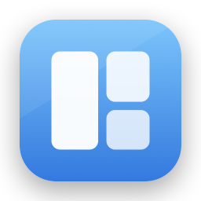

<p align="center">
  
</p>

<h1 align="center">Zephr</h1>

<p align="center"><b>The tiling window manager that feels like it shipped with the Mac.</b><br>
All of i3. None of the hostility.</p>

<p align="center">
  <a href="https://binbandit.github.io/zephr/"><b>Documentation</b></a> ·
  <a href="https://binbandit.github.io/zephr/keys.html">Keymap</a> ·
  <a href="https://binbandit.github.io/zephr/config.html">Configuration</a> ·
  <a href="docs/DESIGN.md">Design document</a>
</p>

---

- **Real tiling** — an i3-style tree: automatic layouts, workspaces 1–9 per display, focus by direction.
- **Discoverable** — press the leader (⌥ Space) and a command strip shows what every key does; direct ⌃⌥ chords for speed. The defaults never bind bare ⌥, so international typing survives.
- **Never fights you** — dialogs and pickers float automatically; stubborn apps are learned; drag a window and drop zones re-tile it.
- **Layouts that survive real life** — display profiles restore every window's exact position on redock, relaunch, and reboot.
- **Trustworthy** — public APIs only, no SIP changes ever, Hardened Runtime, one explained permission. Quitting restores every window to exactly where it was.
- **Fast and frugal** — per-app isolation so one hung app can't stall the rest; activity-gated background work for battery.

## Install

```sh
git clone https://github.com/binbandit/zephr.git
cd zephr
just app install        # Release build → /Applications, launches it
```

Requires Xcode and [`just`](https://github.com/casey/just). Grant the Accessibility
permission when asked — the [60-second first run](https://binbandit.github.io/zephr/index.html#first-run)
walks you through everything, on your real windows.

## Development

```sh
just test               # ZephrCore engine suite (pure Swift, no permissions)
just run                # Debug build + launch
just release            # archive → Developer ID export → DMG → notarize
```

The engine (`ZephrCore/`) is a pure Swift package — tree, solver, workspaces,
profiles — fully unit-tested including property tests. The app (`Zephr/`) is the
AX/AppKit shell around it. Architecture notes live in [CONTRIBUTING.md](CONTRIBUTING.md) and
the full product spec in [docs/DESIGN.md](docs/DESIGN.md).
